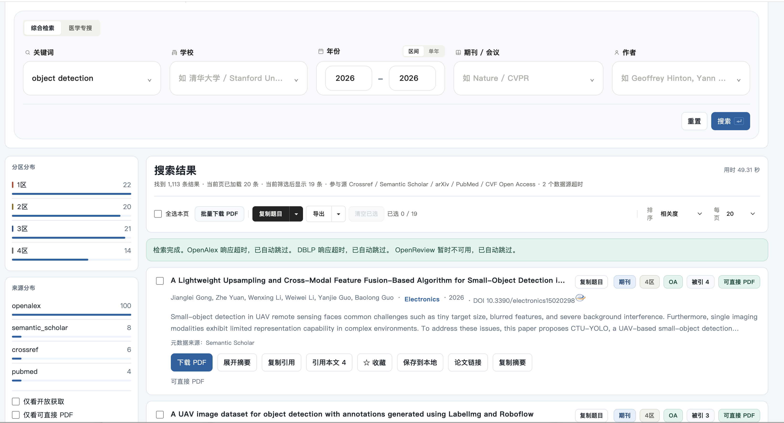
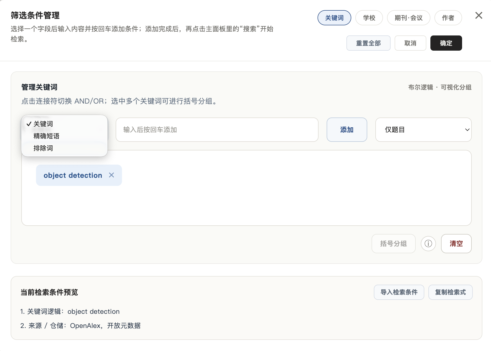
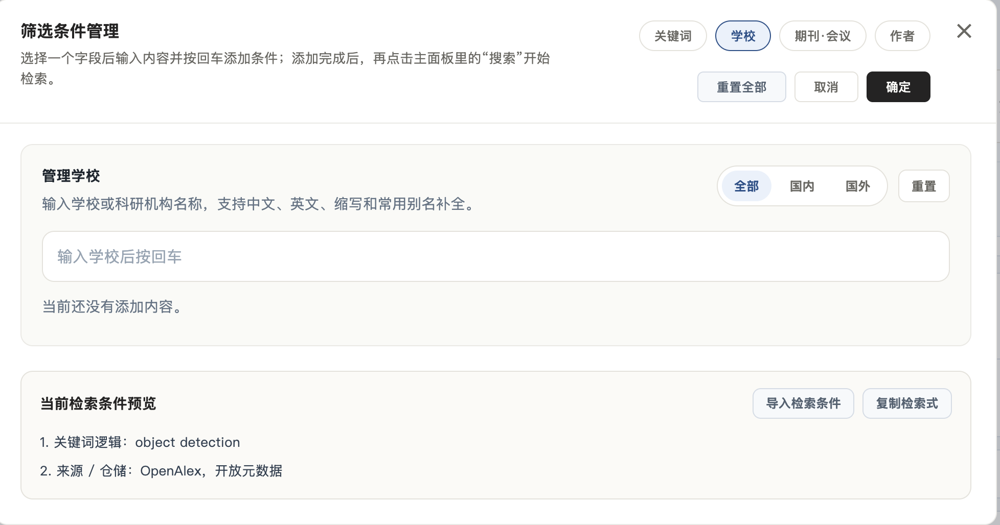
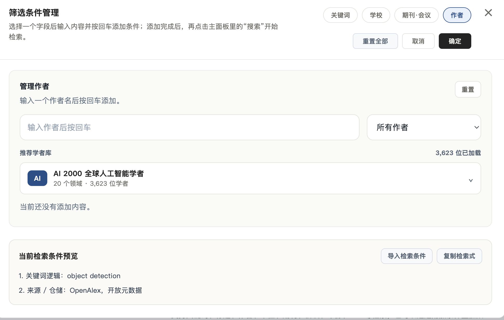

# PaperScope

  <a href="README_EN.md">English</a> | <strong>中文</strong>

> 面向科研选题、文献筛选与引用追踪的桌面论文检索助手。

  
  
  
  

**PaperScope** 是一款本地运行、联网检索的论文检索软件，适合研究生、科研人员、教师和工程研发人员用于查论文、做综述、找选题、追踪引用与整理检索结果。

本仓库仅提供已经编译完成的 Windows 和 macOS 软件包，**不包含源代码**。

## 快速下载

建议下载最新版本：[PaperScope v1.8](https://github.com/Daniel123jia/PaperScope/releases/tag/v1.8)。

全部版本请前往：[GitHub Releases](https://github.com/Daniel123jia/PaperScope/releases)。

| 版本 | 首次启动试用期 | Windows | Intel Mac | Apple 芯片 Mac | 主要更新 |
| --- | ---: | :---: | :---: | :---: | --- |
| [v1.8](https://github.com/Daniel123jia/PaperScope/releases/tag/v1.8) | 10 天 | 支持 | 支持 | 支持 | 新增 AI 论文雷达、顶刊顶会论文档案库、研究主题地图、引用脉络分析、更多界面主题；主检索默认深度检索，并增强智能选刊入口 |
| [v1.7](https://github.com/Daniel123jia/PaperScope/releases/tag/v1.7) | 10 天 | 支持 | 支持 | 支持 | 新增普通 / 深度检索、标题方向分类、智能选刊、引用本文分类整理、论文邮件发送和手动订阅；优化数据源路由、去重与 PDF 下载安全 |
| [v1.6](https://github.com/Daniel123jia/PaperScope/releases/tag/v1.6) | 10 天 | 支持 | 支持 | 支持 | 增强期刊 / 会议筛选；新增官方会议论文集补充检索；优化多源检索稳定性 |
| [v1.5](https://github.com/Daniel123jia/PaperScope/releases/tag/v1.5) | 10 天 | 支持 | 支持 | 支持 | 结果页重做；新增论文解析模板；优化“复制题目到 AI 解析”和检索稳定性 |
| [v1.4](https://github.com/Daniel123jia/PaperScope/releases/tag/v1.4) | 7 天 | 支持 | 支持 | 支持 | 新增“引用本文”；新增计算机领域中科院分区筛选；优化 CCF 分类和英文界面 |
| [v1.3](https://github.com/Daniel123jia/PaperScope/releases/tag/v1.3) | 20 天 | 支持 | 支持 | 支持 | 新增中英文界面、多数据源检索编排、多种界面背景 |
| [v1.2](https://github.com/Daniel123jia/PaperScope/releases/tag/v1.2) | 7 天 | 支持 | 支持 | 支持 | 首个同时支持 Windows、Intel Mac、Apple 芯片 Mac 的版本 |
| [v1.1](https://github.com/Daniel123jia/PaperScope/releases/tag/v1.1) | 7 天 | 支持 | 不支持 | 不支持 | 仅提供 Windows EXE 和便携版 ZIP |

> 每个版本保留发布时内置的试用期限。同一版本再次打开不会重新计时，不同版本使用各自独立的试用记录。试用无需导入 `license.json`。

## 关于试用期

不同版本会看到 7 天、10 天或 20 天试用期，这是因为 PaperScope 会定期更新新功能，并按当次版本开放对应的体验时间。每个版本都保留发布时的试用设置，方便用户在新版本中体验新增能力。

## v1.8 更新内容

- **AI 论文雷达**：新增独立入口，围绕 AI 方向、关键词、作者、年份、开放获取、PDF 可用性和顶刊顶会来源进行更聚焦的论文追踪。
- **顶刊顶会论文档案库**：新增 CVPR、ICCV、ECCV、NeurIPS、ICML、ICLR、ACL、AAAI、IJCAI 等会议，以及 TPAMI、IJCV、TGRS、TMI、Nature / Science 系列等期刊的档案检索能力。
- **研究主题地图**：按任务、模态、学习范式、方法架构和应用场景组织论文，帮助快速理解一个方向下的代表论文、来源分布和增长趋势。
- **论文荣誉与高价值标签**：档案库支持最佳论文、最佳学生论文、口头报告等标签，便于优先定位更值得精读的论文。
- **引用脉络分析增强**：“引用本文”不只是列出后续文献，还会辅助识别高相关、方法改进、综述、低相关等脉络，方便复制引文题目给 AI 继续分析。
- **智能选刊入口增强**：主检索面板新增快捷入口，可基于当前检索结果快速进入候选期刊推荐。
- **默认深度检索与近 10 年范围**：主检索默认走深度检索；未指定年份时自动带入近 10 年范围，减少无边界检索带来的等待。
- **界面体验升级**：顶部核心入口调整为 AI 论文雷达、论文订阅、论文获取，并新增学术蓝、纸张、深海、午夜、AI 紫等主题。
- **打包稳定性增强**：v1.8 继续提供 Windows、Intel Mac、Apple 芯片 Mac 三套可下载软件包，试用期为 10 天。

## v1.7 更新内容

- **普通检索 / 深度检索分开**：普通检索更适合快速查找，深度检索适合需要更完整覆盖时使用；深度检索支持进度提示、覆盖报告和手动取消。
- **标题方向分类**：检索结果会根据论文标题识别高频研究方向，结果侧栏可按方向筛选，论文卡片也会显示方向标签，便于快速判断一批结果主要集中在哪些主题。
- **智能选刊**：基于当前检索结果和分析范围生成候选期刊清单，结合分区、影响因子、命中论文分布和本地期刊匹配信息，辅助判断投稿或重点阅读来源。
- **引用本文分类处理**：“引用本文”中的后续文献可以结合标题方向、来源和引用信息做分类整理，方便判断后续研究是方法改进、应用扩展还是相关方向延伸。
- **数据源路由与去重优化**：根据检索主题和期刊 / 会议选择更合适的数据源，减少不必要的超时；DOI、arXiv、PMID、PMCID 等稳定标识的去重更严格。
- **论文邮件发送**：可配置 SMTP 邮箱，把单篇论文结果通过邮件发送给自己或指定收件人，方便跨设备整理。
- **手动论文订阅**：可保存当前检索条件为订阅，设置时间范围、发送频率和最多推送数量，用于追踪新增论文。
- **PDF 下载安全增强**：加强 PDF 链接校验，限制异常跳转和内网地址，降低下载公开 PDF 时的风险。
- **AI 服务设置增强**：新增常见 AI 服务商配置入口，便于后续把“复制题目到 AI 解析”“复制引文到 AI 解析”等流程做得更顺手。

## 功能亮点

- **多条件组合检索**：支持关键词、精确短语、排除词、仅题名检索，并可切换 AND / OR 与括号分组。
- **学校与机构筛选**：支持中文、英文、缩写和常见别名补全，便于查看高校、科研机构或课题组成果。
- **期刊与会议筛选**：支持中科院分区、CCF 分类、期刊 / 会议切换、学科收窄与刊名过滤。
- **分区化结果浏览**：检索结果可按分区、来源、开放获取状态和 PDF 可用性辅助判断，方便快速筛出值得优先阅读的论文。
- **标题方向分类**：按论文标题识别研究方向，并支持点击方向筛选当前结果。
- **智能选刊**：根据检索结果生成候选期刊清单，可用于投稿选刊和重点来源判断。
- **作者与学者库**：支持作者筛选，并内置推荐学者库，方便追踪目标导师、合作团队和领域代表学者。
- **复制题目进行 AI 解析**：一键复制论文题目，配合自定义解析模板，粘贴到 ChatGPT、Claude 等大模型中快速了解论文背景、方法、贡献和适合精读的价值。
- **引用本文分类处理与 AI 解析**：可以点开“引用本文”查看后续文献，并结合标题方向、来源和引用信息分类整理；也可以复制引用论文题目，用大模型快速梳理后续研究脉络、改进方向和潜在创新点。
- **v1.8 AI 论文雷达与档案库**：新增顶刊顶会论文雷达、顶刊顶会档案检索、研究主题地图、论文荣誉标签和引用脉络分析，更适合追踪 AI 领域热点与高价值论文。
- **v1.7 检索与订阅工作流增强**：普通 / 深度检索分流，新增覆盖报告、论文邮件发送、手动订阅和 PDF 下载安全校验，更适合持续追踪某个研究方向。
- **v1.6 官方会议与筛选增强**：完善期刊 / 会议筛选面板，新增 AAAI OJS、NeurIPS Proceedings 以及 ACL、EMNLP、ICML、COLT、IJCAI 等官方会议论文集补充检索，并改进多源去重、统计和超时降级。
- **v1.5 结果页与模板增强**：结果页布局更清晰，新增论文解析简洁版 / 完善版模板，并优化重复检索时的数据源缓存与引用数显示。
- **开箱即用**：下载软件包即可运行，不需要用户额外安装 Python、Node.js 或开发环境。

## 典型流程：检索后交给 AI 快速解析

下面是一个示例：关键词输入 `few-shot`，年份选择 `2026`，期刊选择 `IEEE Transactions on Pattern Analysis and Machine Intelligence`。PaperScope 会聚合公开学术数据源，并把检索出来的论文按分区、来源、开放获取状态和 PDF 可用性展示出来。示例中检索用时从约 `24 秒` 降到 `8.32 秒`。

  

这个流程的价值在于：

1. **先筛选，再阅读**：先看分区、来源、年份、是否 OA、是否有 PDF，快速判断哪些论文值得优先处理。
2. **复制论文题目给 AI 解析**：使用“复制题目”把当前结果的论文题目复制出来，解析模板可以自行设置，再粘贴到 ChatGPT 或 Claude 中批量了解论文方向、方法和创新点。
3. **复制引文题目做追踪**：点开“引用本文”后，可以复制引用这篇论文的后续文献题目，再交给大模型分析后续研究如何改进、扩展或应用原论文。

## 功能截图

下面几张图展示的是 PaperScope 的核心筛选能力。用户可以先输入研究主题，再按关键词逻辑、学校机构、期刊会议、作者等维度逐步缩小结果范围。

<table>
  <tr>
    <td width="50%" valign="top">
      <strong>关键词布尔检索</strong> 
      支持关键词、精确短语、排除词和仅题名检索；可以切换 AND / OR，并用括号分组构造更精确的检索式。适合从大量结果中排除无关方向，例如排除医学、自动驾驶等不相关场景。  
      
    </td>
    <td width="50%" valign="top">
      <strong>学校 / 机构筛选</strong> 
      可通过学校、科研院所、英文名、缩写和常见别名进行筛选。适合查看某所高校、实验室或研究机构在指定主题下的论文产出。  
      
    </td>
  </tr>
  <tr>
    <td width="50%" valign="top">
      <strong>期刊 / 会议筛选</strong> 
      融入多个领域的期刊与会议信息，支持中科院分区、CCF 分类、学科收窄、刊名过滤和会议 / 期刊切换。适合快速定位高价值来源与目标投稿方向。  
      
    </td>
    <td width="50%" valign="top">
      <strong>作者与推荐学者库</strong> 
      支持按作者姓名筛选，并提供推荐学者库。适合追踪目标导师、领域代表学者、合作团队或某个研究社区的最新成果。  
      
    </td>
  </tr>
</table>

## 下载与安装

**Windows 用户**建议下载对应版本的便携版 ZIP，例如：

- [`ScholarHub_Portable_v1.8.zip`](https://github.com/Daniel123jia/PaperScope/releases/download/v1.8/ScholarHub_Portable_v1.8.zip)
- [`ScholarHub_Portable_v1.7.zip`](https://github.com/Daniel123jia/PaperScope/releases/download/v1.7/ScholarHub_Portable_v1.7.zip)
- [`ScholarHub_Portable_v1.6.zip`](https://github.com/Daniel123jia/PaperScope/releases/download/v1.6/ScholarHub_Portable_v1.6.zip)
- [`ScholarHub_Portable_v1.5.zip`](https://github.com/Daniel123jia/PaperScope/releases/download/v1.5/ScholarHub_Portable_v1.5.zip)
- [`ScholarHub_Portable_v1.4.zip`](https://github.com/Daniel123jia/PaperScope/releases/download/v1.4/ScholarHub_Portable_v1.4.zip)
- [`ScholarHub_Portable_v1.3.zip`](https://github.com/Daniel123jia/PaperScope/releases/download/v1.3/ScholarHub_Portable_v1.3.zip)
- [`ScholarHub_Portable_v1.2.zip`](https://github.com/Daniel123jia/PaperScope/releases/download/v1.2/ScholarHub_Portable_v1.2.zip)
- [`ScholarHub_Portable_v1.1.zip`](https://github.com/Daniel123jia/PaperScope/releases/download/v1.1/ScholarHub_Portable_v1.1.zip)

下载后解压 ZIP，再双击其中的 `论文检索助手.exe`。每个 Release 也提供可直接下载的单文件 EXE。部分历史软件包文件名保留了早期命名 `ScholarHub`，不影响 PaperScope 正常使用。

**macOS 用户**请先确认芯片类型：

- Intel Mac：下载文件名包含 `macOS_Intel` 的 ZIP。
- Apple 芯片 Mac：下载文件名包含 `macOS_AppleSilicon` 的 ZIP。

下载后双击 ZIP 解压，再打开 `论文检索助手.app`。如果 macOS 阻止首次启动，可在“系统设置 → 隐私与安全”中选择“仍要打开”。Mac 软件包使用免费 ad-hoc 签名，没有使用付费 Apple Developer 证书或 Apple 公证，因此首次打开可能出现系统安全提示。

## 使用说明

- 软件需要联网才能检索论文。
- PDF、引用关系和论文元数据覆盖范围取决于公开学术数据源。
- 每个 Release 都提供 SHA-256 校验文件，可用于检查下载文件是否完整。
- 对正式综述、基金申请或论文投稿前的最终检索，建议结合权威数据库和出版社官网交叉验证。

## 交流与反馈

<table>
  <tr>
    <td width="68%" valign="top">
      欢迎反馈使用体验、功能建议、Bug 或论文检索需求。  
      你可以通过 GitHub Issues 留言，也可以扫码添加微信交流。添加好友时可以备注 <code>PaperScope</code>，方便确认来意。
    </td>
    <td width="32%" align="center">
       
      扫码添加微信交流
    </td>
  </tr>
</table>

## 免责声明

PaperScope 聚合公开学术数据源中的论文元数据、链接、引用与分区信息，仅供科研检索和辅助分析使用。重要结论请以出版社官网、期刊会议官网、学校 / 机构官网或权威数据库为准。
