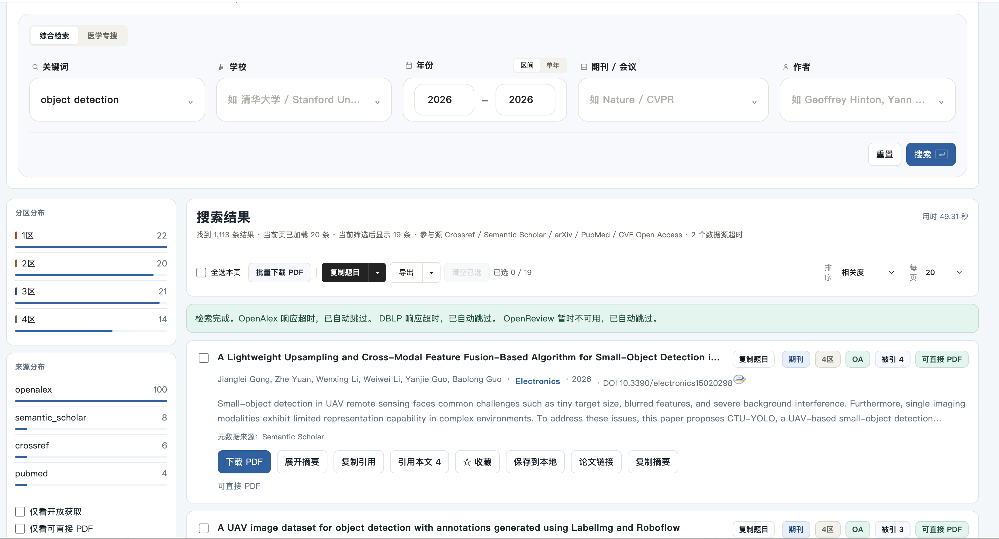
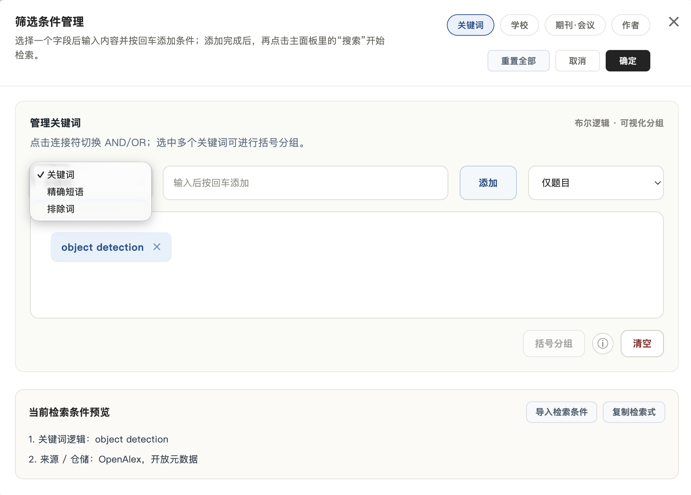
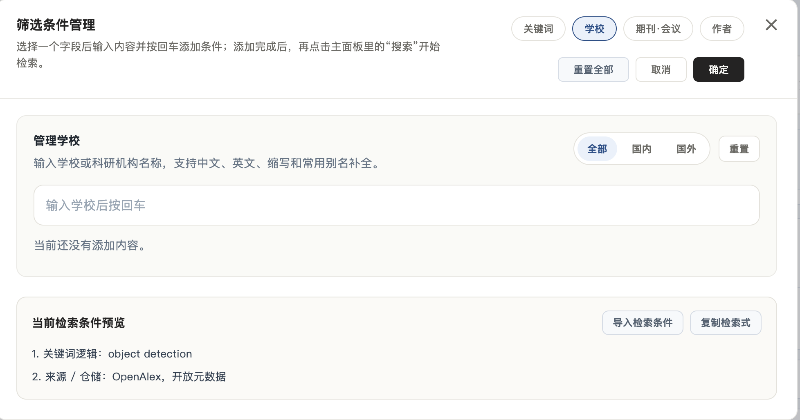
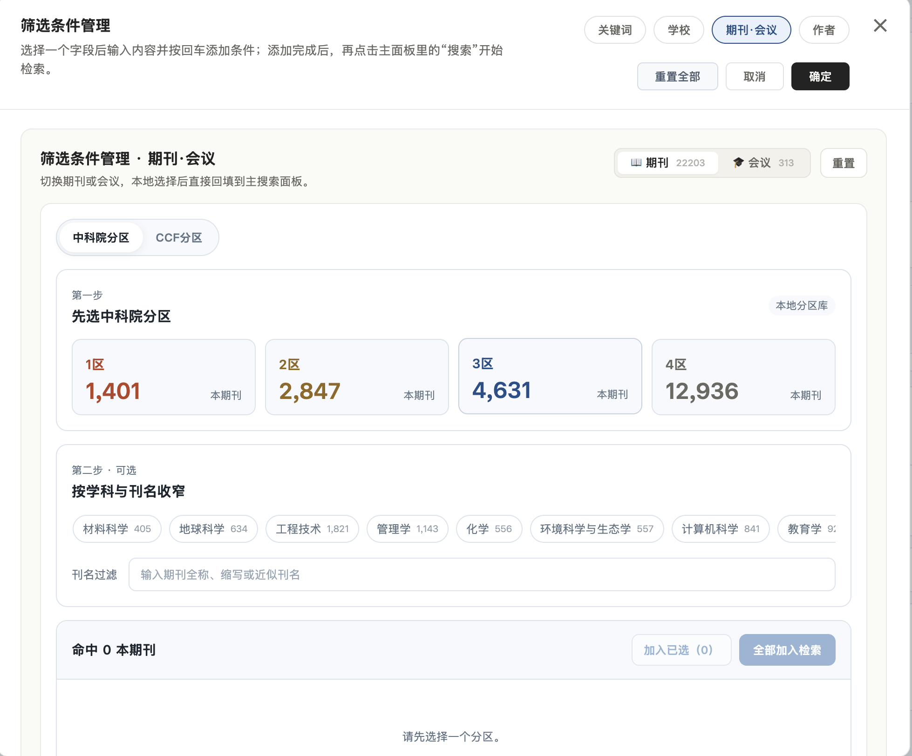
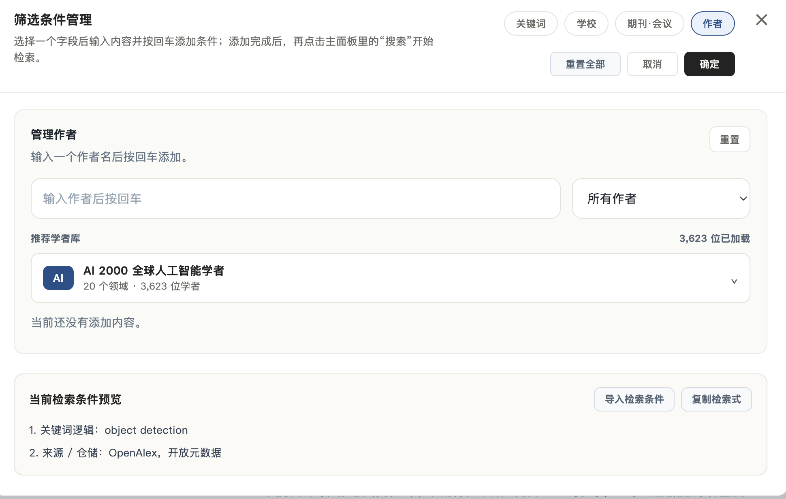

# PaperScope

  <strong>English</strong> | <a href="README.md">中文</a>

> A desktop literature search assistant for research discovery, paper filtering, citation tracing, and AI-assisted reading workflows.

  
  
  
  

**PaperScope** is a local desktop app that searches online academic data sources. It helps researchers, students, teachers, and engineers discover papers, filter results, trace citations, and organize reading candidates.

This repository only provides compiled Windows and macOS packages. **Source code is not included.**

## Download

Recommended version: [PaperScope v1.5](https://github.com/Daniel123jia/PaperScope/releases/tag/v1.5).

All versions are available on [GitHub Releases](https://github.com/Daniel123jia/PaperScope/releases).

| Version | Trial | Windows | Intel Mac | Apple Silicon Mac | Highlights |
| --- | ---: | :---: | :---: | :---: | --- |
| [v1.5](https://github.com/Daniel123jia/PaperScope/releases/tag/v1.5) | 10 days | Yes | Yes | Yes | Redesigned result page, paper-analysis templates, AI title-copy workflow, and search stability improvements |
| [v1.4](https://github.com/Daniel123jia/PaperScope/releases/tag/v1.4) | 7 days | Yes | Yes | Yes | Citing-paper workflow, CAS partition filtering, CCF and English UI improvements |
| [v1.3](https://github.com/Daniel123jia/PaperScope/releases/tag/v1.3) | 20 days | Yes | Yes | Yes | Chinese / English UI, multi-source search orchestration, multiple interface backgrounds |
| [v1.2](https://github.com/Daniel123jia/PaperScope/releases/tag/v1.2) | 7 days | Yes | Yes | Yes | First release with Windows, Intel Mac, and Apple Silicon Mac packages |
| [v1.1](https://github.com/Daniel123jia/PaperScope/releases/tag/v1.1) | 7 days | Yes | No | No | Windows EXE and portable ZIP |

Different versions may provide 7-day, 10-day, or 20-day trials because PaperScope is updated regularly with new features. Each version keeps the trial duration configured at the time of its release.

## Highlights

- **Advanced search conditions**: keywords, exact phrases, exclusion words, title-only search, AND / OR logic, and grouped conditions.
- **School and institution filtering**: filter by Chinese names, English names, abbreviations, and common aliases.
- **Journal and conference filtering**: CAS partitions, CCF categories, disciplines, venue names, and journal / conference switching.
- **Partition-aware result browsing**: quickly prioritize papers by partition, source, open-access status, and PDF availability.
- **Copy titles for AI analysis**: copy paper titles and paste them into ChatGPT, Claude, or other LLMs with your own analysis prompt template.
- **Copy citing-paper titles for AI analysis**: open the citing-paper workflow, copy titles of follow-up works, and ask an LLM to summarize research trends, improvements, and possible gaps.
- **v1.5 result-page and template upgrades**: clearer result layout, simple / detailed paper-analysis prompt templates, better repeated-search caching, and clearer citation-count handling.

## Example Workflow

Example: search for `object detection`, set the year to `2026`, keep journal / conference filters at default, and review results grouped with partition and source information.

  

1. Filter papers by year, source, partition, open-access status, and PDF availability.
2. Use **Copy Title** to send paper titles to ChatGPT or Claude for quick paper analysis.
3. Open **Citing Papers**, copy titles of follow-up works, and use an LLM to understand how later studies extend or improve the original paper.

## Screenshots

<table>
  <tr>
    <td width="50%" valign="top">
      <strong>Keyword Search</strong> 
      Use keywords, exact phrases, exclusion words, title-only search, AND / OR, and grouped logic.  
      
    </td>
    <td width="50%" valign="top">
      <strong>School / Institution Filtering</strong> 
      Filter papers by universities, research institutions, English names, abbreviations, and aliases.  
      
    </td>
  </tr>
  <tr>
    <td width="50%" valign="top">
      <strong>Journal / Conference Filtering</strong> 
      Use CAS partitions, CCF categories, disciplines, and venue-name filtering.  
      
    </td>
    <td width="50%" valign="top">
      <strong>Author Filtering</strong> 
      Filter by author names and use the recommended scholar library to follow research communities.  
      
    </td>
  </tr>
</table>

## Notes

- PaperScope requires internet access for literature search.
- Metadata, PDF links, and citation data depend on public academic data sources.
- Each release includes SHA-256 checksum files for download verification.
- For formal literature reviews, grant applications, or final manuscript checks, please cross-check with authoritative databases and publisher websites.

## Contact

Feedback, feature requests, and bug reports are welcome through GitHub Issues. You can also scan the QR code below to connect on WeChat.

   
  Scan to connect on WeChat

## Disclaimer

PaperScope aggregates paper metadata, links, citation information, and venue classifications from public academic data sources. The information is for research discovery and auxiliary analysis only.
